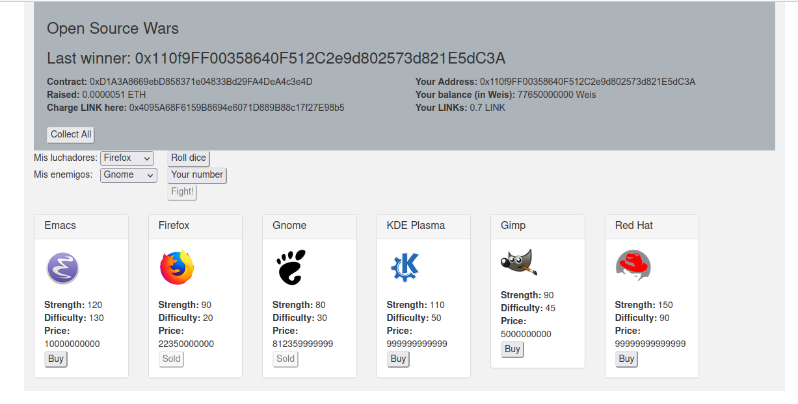

# OpenSourceWars

Este es un ejercicio para obtener la certificación del curso "Programación de contratos inteligentes con Solidity" de Blockchain Academy Chile.
Se deben cumplir las siguientes condiciones:

- [x] Seguridad por medio de permisos (que haya distintos permisos para los tipos de usuario)
- [x] Crear una función que reciba pagos en Ether.
- [x] Consumir alguna librería externa o heredar de un contrato externo (ej: OpenZeppelin). 
  - [x] *He usado Ownable.sol*
- [x] Desplegar los contratos en testnet. (Ej. Rinkeby). 
  - [x] *He usado Kovan*.
- [x] Conexión con oráculo. (Ej. Chainlink). 
  - [x] He usado:
    - [x] VRFConsumerBase.sol
    - [x] ConfirmedOwner.sol
- [x] Habilitar una página web pública que nos permita interactuar con la aplicación usando Metamask.
- [x] Enlace para interactuar con la aplicación. Pronto en [https://kanashiro.me](https://kanashiro.me)
- [x] Repositorio de la aplicación en Github
- [x] Dirección de los contratos inteligentes desplegados en Rinkeby

---

This is an exercise to obtain the certification of Blockchain Academy Chile's "Smart contracts programming with Solidity".
To achieve this, some conditions must be accomplished:

- [x] Security by permissions (must be different permissions for every kind of users)
- [x] Create a function to receive payments in Ether.
- [x] Make us of any external library or inherit from an external contract (eg: OpenZeppelin).
  - [x] *I have used Ownable.sol*
- [x] Deploy contracts in testnet. (Eg: Rinkeby).
  - [x] *I have used Kovan*.
- [x] Connect to an oracle. (Eg: Chainlink)
  - [x] I have used:    
    - [x] VRFConsumerBase.sol
    - [x] ConfirmedOwner.sol
- [x Enable a web page in order to interact with the application using Metamask. 
- [x] Link to interact with the application. Soon: [https://kanashiro.me](https://kanashiro.me)
- [x] Github repo.
- [x] Smart contract address deployed in testnet.

